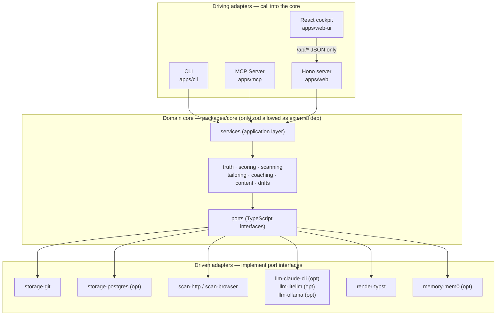

# DESIGN.md — Selfwright System Design

> The authoritative technical design document. Start here if you are evaluating the architecture,
> contributing to the codebase, or building an integration.
>
> References: `docs/adr/` (individual decision records), `docs/domain/context-map.md`
> (bounded-context dependency map), `docs/fitness-functions.md` (executable architecture tests).

---

## Contents

1. [Context](#context)
2. [Goals](#goals)
3. [Non-goals](#non-goals)
4. [Architecture overview](#architecture-overview)
5. [Bounded contexts](#bounded-contexts)
6. [Package layout](#package-layout)
7. [Data model](#data-model)
8. [Model layer](#model-layer)
9. [Web cockpit](#web-cockpit)
10. [Key decisions](#key-decisions)
11. [Security model](#security-model)
12. [Testing and fitness strategy](#testing-and-fitness-strategy)
13. [Alternatives considered](#alternatives-considered)

---

## Context

Most career tools optimize for volume. Selfwright optimizes for truth.

Every claim in a generated cover letter or CV summary must trace back to a verifiable evidence
entry in the owner's private evidence registry. That constraint — the truth floor — is the core
design decision that everything else follows from. It rules out a certain class of output quality
problems permanently: the system cannot produce a claim it cannot support, because the validator
rejects the artifact before the user can use it.

The system started as a private TypeScript tool called `career_plan`. The rebuild into Selfwright
introduced a proper hexagonal domain model, hard data-privacy guarantees, and a clean separation
between the shareable framework code and the private personal data. That boundary is what makes
an open-source release possible without exposing the owner's professional history, compensation
data, or named contacts.

---

## Goals

The platform has four goals, ordered by implementation dependency:

1. **Career engine.** Produce truth-validated CVs, cover letters, and ATS-tuned applications.
   Automatically discover and score roles from ATS job boards and aggregators across the owner's
   defined archetypes.
2. **Coach.** Prepare for interviews and networking events with evidence-backed prep packs.
   Analyse debriefs to surface recurring gaps, and run targeted drills between rounds.
3. **Content.** Propose articles to write and read, per archetype, backed by scored sources.
4. **Expertise.** Track a deliberate learning roadmap across software, data, and AI engineering.

v1 (current release) covers goal 1 fully and goal 2 substantially. Goals 3 and 4 are in active
development.

---

## Non-goals

- **No autonomous final submission.** The system automates discovery, scoring, generation, and
  pre-submit preparation. The one enforced limit: no code path in this repository reaches the
  final submit control on any ATS or career website. The human makes that call. See ADR 0025.
- **No autonomous LLM API calls by default.** The default generation path assembles a
  truth-grounded prompt and writes it to a file. The user generates the output in an
  already-open Claude Code session. No API key is stored in the framework.
- **No multi-user or SaaS hosting.** One person, one private data repository.
- **Not a volume tool.** The goal is defensible, top-quality output on a carefully chosen set of
  roles.
- **No data leaves the machine** except commits to the owner's private GitHub repository and text
  sent to the Claude interface the user already has open.

---

## Architecture overview

Selfwright is a **TypeScript-first hexagonal modular monolith** organized by domain-driven design.
Four principles compose the architecture:

- **Domain-Driven Design.** The domain is partitioned into bounded contexts, each owning its
  types and logic. No bounded context imports another's internals.
- **Hexagonal (ports and adapters).** The domain core defines interfaces (ports) for every
  external capability: storage, LLM, scan provider, renderer, memory. Adapters implement those
  interfaces. The core never imports an adapter or any npm package other than `zod`.
- **Modular monolith.** One repository, one TypeScript build, one `pnpm` workspace. Everything
  deploys together.
- **API-first.** The CLI, MCP server, and web cockpit all call the same application-service
  layer. There is no CLI-only logic.



**The hexagonal boundary is enforced mechanically.** `FF-PORT-1` (powered by dependency-cruiser)
fails the fitness suite if any file inside `packages/core/src/` imports from `packages/adapters/`
or from any npm package other than `zod`. `FF-CONTEXT-1` enforces the bounded-context discipline:
cross-context imports must target the sibling's `index.ts`, never a deep internal file. Both
checks run on every PR.

---

## Bounded contexts

Each directory under `packages/core/src/` is a bounded context. Its public API is its `index.ts`;
callers never import deep files. Two exceptions: `ports/` (hexagonal contracts, importable
directly) and `shared/` (shared kernel, `Result<T, E>` type only).

| Context | Directory | Purpose |
|---------|-----------|---------|
| `truth` | `packages/core/src/truth/` | Schemas, evidence tracing, honesty wall, R19 fabrication guard |
| `scoring` | `packages/core/src/scoring/` | JD fit scoring, ATS pass A/B, priority ranking |
| `scanning` | `packages/core/src/scanning/` | Fetch postings, liveness classification, dedup, queue management |
| `tailoring` | `packages/core/src/tailoring/` | Apply overlays and drift applications to a CV |
| `coaching` | `packages/core/src/coaching/` | Gap coverage, evidence retrieval, drill selection, debrief analysis |
| `content` | `packages/core/src/content/` | Topic selection (application-mode and periodic) |
| `drifts` | `packages/core/src/drifts/` | Drift scoring, validation, filtering |
| `services` | `packages/core/src/services/` | Application services — orchestrates contexts for CLI/MCP commands |
| `ports` | `packages/core/src/ports/` | Hexagonal contracts (LLM, storage, scan provider, render, memory) |
| `shared` | `packages/core/src/shared/` | Shared kernel: `Result<T, E>` type only |

Dependency direction (from `docs/domain/context-map.md`):

```
services → coaching · content · scoring · tailoring · truth · scanning
scoring  → truth
coaching → truth
tailoring → truth · scoring
scanning  → truth · scoring · ports
content   → coaching · scoring · truth
drifts    → truth
```

No upward imports from `services`. No context may import from `services`.

---

## Package layout

```
selfwright/
├── packages/
│   ├── core/                      # Pure domain — no I/O, only zod
│   ├── api-contract/              # Zod schemas for the /api/* JSON wire contract
│   ├── shared-config/             # Config-file schemas (models.yml, scan-targets.yml, settings.yml)
│   ├── shared-logger/             # Structured logger (method + path + status, no PII)
│   ├── shared-notify/             # ntfy push notifications (IDs only)
│   └── adapters/
│       ├── storage-git/           # Read/write the data directory (YAML, git commits)
│       ├── storage-postgres/      # Postgres projection sync (rebuildable, not the truth source)
│       ├── scan-http/             # 18 HTTP providers (ATS boards + aggregators + generic)
│       ├── scan-browser/          # Workday browser provider via Playwright (bot-gated boards)
│       ├── llm-claude-cli/        # Optional: shells `claude --print` (headless escape hatch)
│       ├── llm-litellm/           # Optional: LiteLLM proxy (OSS multi-provider path)
│       ├── llm-ollama/            # Optional: local inference (eval-gated, off by default)
│       ├── render-typst/          # CV render to PDF/DOCX via Typst
│       └── memory-mem0/           # Episodic memory via mem0 (MCP-exposed)
├── apps/
│   ├── cli/                       # selfwright <cmd> — the primary command surface
│   ├── mcp/                       # MCP server — exposes tools to Claude Code/Cursor/OpenCode
│   ├── web/                       # Hono: /api/* JSON + static host + login page
│   ├── web-ui/                    # React SPA (Vite + React 18 + Tailwind CSS)
│   └── api/                       # Reserved stub
├── fitness/                       # Executable fitness-function suite (pnpm fitness)
├── tools/                         # sync-db, doctor, git hooks, install scripts
├── evals/                         # Quality-equivalence eval harness
├── config/                        # models.yml (logical role → Claude model hint)
├── infra/                         # docker-compose.yml (postgres, ollama, mem0, metabase, litellm)
├── examples/data-template/        # Starter data directory for new users
└── data/                          # Gitignored. Personal data lives in a separate private repo.
```

---

## Data model

### Source of truth: the private data repository

The owner's data lives in a separate, private `Selfwright-data` git repository. Every
authoritative fact is a file; the git commit history is the audit trail. The framework repo
contains no personal data: `data/` is gitignored, and `FF-DATA-LEAK-1` blocks any personal-data
pattern from being committed to the framework at pre-commit, pre-push, and in CI.

```
Selfwright-data/
├── truth/
│   ├── identity.yml               # Professional identity, roles timeline, honesty boundaries
│   ├── evidence/registry.yml      # EVD-* evidence entries — the truth source
│   ├── archetypes/*.md            # Positioning lanes with YAML front matter
│   ├── keyword-ontology.yml       # Domain keyword taxonomy for scoring and gap analysis
│   └── gaps.yml                   # Skill gaps ledger
├── applications/
│   └── applications.yml           # Application records and status history
├── drifts/
│   └── companies/<slug>.yml       # Per-company drift entries
├── pipeline/
│   ├── scan-targets.yml           # ATS boards and companies to scan
│   ├── queue.yml                  # Discovered roles pending triage
│   └── scan-history.yml           # Dedup seen-set (write-once, append-forever)
└── coaching/
    ├── debriefs.yml               # Post-interview structured records
    └── drill-history.yml          # Drill question history
```

### Evidence registry and EVD-* ids

Every substantive professional claim is an evidence entry with a unique identifier in the format
`EVD-<SCOPE>-<IDX>` (for example, `EVD-PM-001`). Downstream files reference these IDs. The truth
floor (enforced by `FF-TRUTH-1` and `FF-R19`) requires every substantive sentence in a generated
artifact to share keyword overlap with at least one EVD-* entry. A generated artifact that fails
this check is rejected before the user can use it. `FF-TRUTH-2` catches dangling EVD-* references
(IDs cited in YAML files that no longer exist in the registry).

### Postgres: a rebuildable projection

`tools/sync-db` populates Postgres from the data directory. Postgres is a projection, not the
source of truth. Dropping and rebuilding the database loses nothing permanent. pgvector enables
semantic retrieval — finding relevant evidence for a JD without exact keyword overlap. The web
dashboard reads the data directory directly, not Postgres (ADR 0009).

### Archetypes

An archetype is a named positioning lane with target titles, match keywords, evidence selections,
and CV slant. The owner can define multiple archetypes (e.g., one for data platform roles, one for
enterprise architect roles). All scoring, tailoring, and scanning operate against the active
archetype set.

### Drifts

A drift is a specific, confidence-banded claim that goes slightly beyond what the evidence strictly
supports — always with a documented rationale, risk score, and honesty note. Drifts are the only
sanctioned exception to the truth floor. They are applied per-application via `drift_applications`
in the tailoring overlay and are ledgered with status tracking. Retired drifts are never deleted;
the honesty wall scanner (`FF-TRUTH-3`) flags any output that uses keywords from a retired drift.

---

## Model layer

### Co-piloted generation (the default)

No API key is stored in the framework. The default generation path, covering cover letters,
research documents, drill questions, prep packs, and topic suggestions, works like this:

1. Selfwright deterministically assembles a truth-grounded prompt: evidence selected by keyword
   relevance to the JD, archetype framing, identity context.
2. The prompt is written to a local file (e.g. `cover-prompt.md`).
3. The user generates the output in an already-open Claude Code session and saves it alongside
   the prompt.
4. The user runs `selfwright <cmd> --check` to validate the artifact. The validator rejects any
   sentence that cannot be traced to an EVD-* entry, flags banned AI-tell phrases (22 entries in
   `packages/core/src/services/ai-tells.ts`), and checks honesty wall constraints.

This works because Selfwright is designed to run inside the same Claude Code session the user
already uses. No marginal API cost. No key management.

`FF-LLM-1` enforces the default: the fitness check fails if any file in `apps/` instantiates a
concrete LLM adapter without an explicit `--adapter` opt-in marker.

### Headless escape hatch (opt-in)

Passing `--adapter cli` on the `cover`, `research`, `drill`, `prep-pack`, or `topics` commands
shells `claude --print` via `ClaudeCliAdapter` (`packages/adapters/llm-claude-cli`). Passing
`--adapter litellm` routes through a LiteLLM proxy (`packages/adapters/llm-litellm`). Both are
behind the same `LlmPort` interface. Neither is the default composition path.

### Local inference (optional, eval-gated)

`packages/adapters/llm-ollama` enables fully local generation via an Ollama instance. It is off
by default. It can only be activated for a task when a quality-equivalence eval (`evals/`) shows
the local model matches Claude's output on that specific task (ADR 0008). Local embeddings for
pgvector always run locally — embedding quality is stable enough across models to make local the
right default.

### Model routing

`config/models.yml` maps logical roles (e.g. `cover-draft`, `research`, `drill`) to Claude model
hints. These hints are consumed by the optional headless adapters; the default co-pilot path
reads them only to display to the user as a generation suggestion.

---

## Web cockpit

`apps/web-ui` is a React 18 SPA (Vite + Tailwind CSS). Eight client-routed pages: Overview,
Inbox, Pipeline, Queue, Coaching, Content, Reporting, Settings. All data arrives through the
typed `/api/*` JSON contract in `packages/api-contract` (Zod schemas shared between server and
client). The cockpit imports nothing from `@selfwright/core` or `@selfwright/adapter-storage-git`
directly. `FF-WEB-1` clause (j) enforces this permanently.

The Hono server (`apps/web`) after T5.10 serves three things: the `/api/*` JSON contract
(ADR 0023), the cockpit's static bundle with SPA fallback, and the still-server-rendered login
page. Zero server-rendered page routes remain. `FF-WEB-1` clause (i) enforces this as a
permanent regression gate.

**Remote access.** The server binds `127.0.0.1:8787` only. Remote access is via Tailscale Serve
(WireGuard end-to-end, tailnet-only). Cloudflare Tunnel was rejected because its edge terminates
TLS, making Cloudflare a processor of plaintext PII. ADR 0016.

**Write surface.** Six write routes, all behind session auth, fail-closed origin check, CSRF
token (header-carried for JSON, `verifyCsrfToken()` throughout), per-session write throttle
(10/min), and a shared serialized write lock. Every write commits to the data repository's git
history as the audit trail. A pre-commit hook rejection reverts the file and surfaces the hook's
message as HTTP 422.

**`/api/*` endpoints** (full table in `docs/MANUAL.md` §2.8):

| Method | Path | Purpose |
|--------|------|---------|
| GET | `/api/meta` | Contract version, platform version, CSRF token |
| GET | `/api/overview` | North-star, fitness sparkline, inbox summary |
| GET | `/api/inbox` | Three-tier digest (decide-now / review-soon / fyi) |
| GET | `/api/applications` | Full applications list |
| POST | `/api/applications/:id/status` | Update application status |
| GET | `/api/queue` | Queue entries partitioned by aging window |
| POST | `/api/queue/:id/promote` | Promote queue entry to application (ADR 0024) |
| POST | `/api/queue/:id/dismiss` | Dismiss queue entry (ADR 0024) |
| GET | `/api/coaching` | Debriefs, drill suggestion, prep packs |
| POST | `/api/debriefs` | Capture a debrief |
| GET | `/api/content` | Content digest list and latest digest inline |
| GET | `/api/reporting` | North-star detail, channel outcomes, fitness trend |
| GET/PUT | `/api/settings` | Read or replace settings.yml |
| GET/PUT | `/api/scan-targets` | Read or replace pipeline/scan-targets.yml |

---

## Key decisions

The full decision log is in `docs/adr/`. Each significant change has its own ADR. The founding
decisions (D1–D31) were recorded in a private founding ledger not included in this public
release; the public architectural record is the ADR set below.

| ADR | Decision |
|-----|----------|
| 0001 | Platform architecture baseline: hexagonal modular monolith + DDD + API-first |
| 0005 | Drift application is a governed operation — confidence-band gating, object-only schema |
| 0006 | Co-piloted generation replaces LiteLLM as the default (no API keys in framework) |
| 0007 | Deterministic scanner: 19 providers (ATS boards + aggregators + browser), liveness + dedup + scoring |
| 0008 | Local inference (Ollama) is optional and eval-gated before activation |
| 0009 | Postgres + pgvector is a rebuildable projection, never the source of truth |
| 0016 | Local web cockpit: React SPA over typed /api/*, behind Tailscale + session auth |
| 0017 | Named-entity data-leak scan derived live from the private data at hook time |
| 0021 | Open-core OSS: Apache-2.0, fresh-history extraction, data repo stays private |
| 0023 | Typed /api/* JSON contract in a dedicated `api-contract` package |
| 0024 | Queue-triage write actions: promote and dismiss semantics |

---

## Security model

### No telemetry and data egress

Selfwright ships with zero telemetry, analytics, crash reporting, or usage tracking. Nothing is ever
sent to the maintainer or any analytics vendor. It is local-first: your career data lives on your
own machine, in your own git-backed data directory, and is never transmitted anywhere by default.

The only outbound network traffic the framework code ever generates is to services you explicitly
configure. Job boards listed in your scan config receive search parameters only — keywords and
location — never CV content or identity data. The optional model gateway (`LiteLLM`, `Ollama`, or
`claude --print` via `ClaudeCliAdapter`) is off by default and requires an explicit `--adapter`
opt-in; `FF-LLM-1` fails the build if any file in `apps/` instantiates a concrete adapter without
that marker. Push notifications via ntfy (if `SELFWRIGHT_NTFY_URL` is set) carry item IDs and
queue counts only — no job titles, company names, or claim text.

Three CI fitness checks enforce this contract permanently: `FF-EGRESS` (SSRF structural guard —
every outbound `fetch`/`page.goto` call must route through a named URL-validation guard),
`FF-LLM-1` (no default LLM adapter in `apps/`), and `FF-DATA-LEAK-1` (no PII or secrets in
committed code). All three fail the build if violated.

---

### Data-leak gate (the #1 safety control)

`FF-DATA-LEAK-1` runs at pre-commit, pre-push, and in CI. It checks three things: no files under
`data/` are tracked by git, gitleaks finds no secrets, and known PII regex patterns (phone,
salary, email) match nothing staged.

A second, independent scanner (`tools/src/hooks/named-entity-scan.ts`) derives the
confidential-name blocklist live from the private data directory at hook time — company names,
contact names, hiring managers, referrers — and fails closed if the data directory is absent.
The matched names are never written to disk or to any log; only the offending file path is
reported. A third scanner (`tools/src/hooks/machine-identity.ts`) checks that the owner's
machine username, hostname, personal email, and any local absolute path (`C:\Users\<name>` in
Windows or `/c/Users/<name>` in Git Bash) never appear in any committed file or commit message.
ADR 0017.

### Local-first

No data leaves the machine except commits to the private GitHub repository and text sent to the
Claude interface the user already has open. No third-party analytics. No telemetry uploads. ntfy
push notifications carry IDs only, never content.

### Web dashboard

Loopback bind (`127.0.0.1`) only. Tailscale Serve for remote access (WireGuard, no plaintext in
transit). Password hash stored in the private data repo, gitignored, never in the framework.
Session cookie: `HttpOnly; Secure; SameSite=Strict`. `Cache-Control: no-store` on every
authenticated response. No stack traces in error responses. `FF-WEB-1` enforces 10 assertions
about these properties as a permanent fitness check.

### Egress (SSRF prevention)

`FF-EGRESS` (static structural scan) requires every outbound `fetch`, `undici`, or `page.goto`
call in adapters and apps to route its URL through a named validation guard. The guard itself
(`packages/adapters/scan-http/src/url-guard.ts`) does DNS-level SSRF validation. The fitness
check asserts the guard is called; the guard's own logic closes the actual network-level attack
surface.

### License and supply chain

Apache-2.0. AGPL dependencies (Metabase) are arm's-length: image-only Docker Compose service,
zero SDK imports into the framework. `gitleaks` and dependency vulnerability scanning run in CI.

---

## Testing and fitness strategy

### TDD on deterministic code

Pure functions — scoring, ATS, parsers, dedup, drift application, ETL row guards — are written
test-first with Vitest. Coverage is gated by CI. Tests run before the fitness suite on every PR.

### Eval harness on LLM paths

Quality-equivalence evals (`evals/`) compare Claude output against golden references.
A local model (Ollama) can only be enabled for a task when an eval confirms parity on that
specific task. ADR 0008.

### 33 fitness functions

`pnpm fitness` runs the full suite. 28 run in every CI push (Tier 1, synthetic fixtures only).
5 additional checks run locally against real data (Tier 2 — skip gracefully in CI). All 33 must
pass (or skip, for Tier 2 in CI) before a PR merges. Checks are grouped by concern:

| Group | Key checks |
|-------|-----------|
| Truth integrity | FF-TRUTH-1 (truth-trace), FF-TRUTH-2 (dangling EVD-*), FF-TRUTH-3 (honesty wall), FF-TRUTH-4 (identity consistency), FF-TRUTH-5 (R19 guard) |
| Privacy / data-leak | FF-DATA-LEAK-1 (PII + secrets), FF-EGRESS (SSRF structural gate), FF-CRED (secret-path gitignore) |
| Architecture | FF-PORT-1 (hexagonal boundary), FF-CONTEXT-1 (bounded-context discipline), FF-LAZY-1 (no TODO/skipped tests) |
| LLM / generation | FF-LLM-1 (no default API-key adapter), FF-GEN-1 (generated artifact truth-trace), FF-AISOUND (zero banned AI-tell phrases) |
| Scoring quality | FF-ATS (ATS ≥ 0.80 on golden fixture), FF-FIT-1 (fit non-degeneracy) |
| Web safety | FF-WEB-1 (10 security assertions), FF-APICONTRACT (contract test suite) |
| Cost / determinism | FF-COST-1 (≤ 50,000 tokens per application workflow), FF-DET-1 (byte-identical output on two runs) |
| Scanner | FF-SCAN-1 (liveness classification), FF-SCAN-2 (dedup correctness), FF-SCAN-3 (no silent provider failures — all providers emit a warn on zero results) |
| Input hardening | FF-INPUT (null/malformed YAML rows rejected cleanly) |

Checks are tiered: Tier 1 uses synthetic fixtures (no private data, always runs in CI); Tier 2
requires `SELFWRIGHT_DATA_DIR` and runs locally before merge. Cloud CI never has access to the
private data directory — that gap is explicit and honest (ADR 0017).

### Contract tests

`apps/web/src/__tests__/api-contract.test.ts` runs against a hermetic `git init` data directory.
Every documented endpoint must have coverage; `FF-APICONTRACT` enforces this structurally (it
fails if a documented endpoint has no matching test) and behaviorally (it runs the test suite and
requires exit 0). A concurrent-write test fires two writes on the same application ID and confirms
exactly one succeeds, proving the serialized write lock (`apps/web/src/write-lock.ts`) works
across both surfaces.

---

## Alternatives considered

**LiteLLM as the default gateway** (anchor D11, superseded ADR 0006). The owner decided against
API-key-billed inference. The `LlmPort` interface and `LiteLlmAdapter` are kept as an optional
headless escape hatch, accessible via `--adapter litellm`.

**Cloudflare Tunnel for web dashboard remote access.** Edge TLS termination makes Cloudflare a
processor of plaintext PII. Tailscale Serve, which carries WireGuard-encrypted packets through
DERP relays without decrypting them, was chosen instead.

**Neo4j as a second projection layer.** Designed for in ADR 0009 and deferred: relationship and
lineage queries are not needed at current data volumes. pgvector handles semantic retrieval.
Neo4j enters when a GraphRAG or second-brain use case makes the graph structure earn its place.

**Publishing the current repo history as the public release.** Intermediate commits contained
since-redacted confidential names. A fresh-history snapshot (ADR 0021) eliminates the problem
without a destructive rewrite.

**Server-rendered Hono JSX pages.** The original T3.6 web cockpit. Replaced in T5.10 when the
cockpit grew from a read-only status page into the primary daily workflow surface — status
transitions, queue triage, debrief capture, settings — that required a client-side router to
manage state cleanly. The /api/* contract (ADR 0023) existed before the SSR pages were deleted,
so the cutover had a stable seam to build against.

**Hand-maintained confidential-names denylist for the data-leak gate.** The prior mechanism.
It failed: nothing forced the owner to populate it, and names were committed to the framework
repo while CI reported green. The current approach derives the blocklist live from the private
data directory at hook time, so it is always current and cannot be forgotten. ADR 0017.
