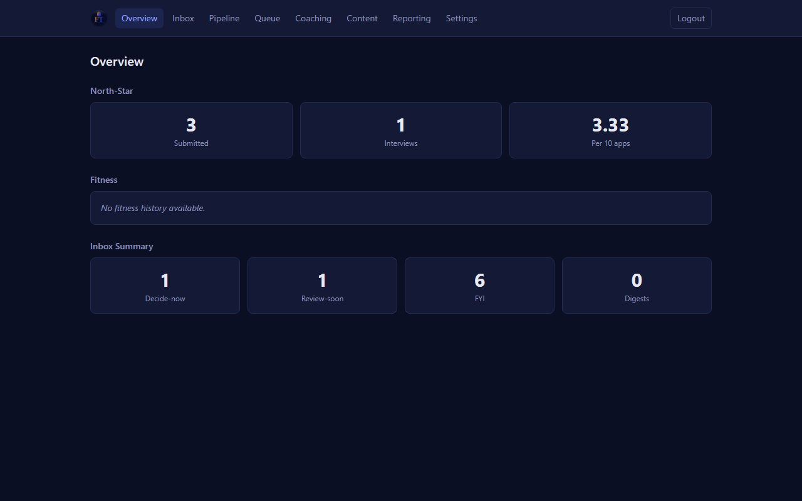

<div align="center">
  

  # Selfwright

  **A local-first career operating system with a truth floor.**

  [](https://github.com/fst-it/Selfwright/actions)
  [](LICENSE)
  [](CHANGELOG.md)
  [](docs/fitness-functions.md)

  [](SECURITY.md)
  [](SECURITY.md)
  [](SECURITY.md)

  [](https://www.typescriptlang.org/)
  [](https://nodejs.org/)
  [](https://react.dev/)
  [](https://vite.dev/)
  [](https://tailwindcss.com/)
  [](https://hono.dev/)
  [](https://www.postgresql.org/)
  [](https://playwright.dev/)
  [](https://pnpm.io/)
  [](https://zod.dev/)
  [](https://www.docker.com/)
</div>

---

Keyword density gets you past an ATS screen. It does not hold up when the same interviewer calls back to probe the specific claim on the page.

Selfwright starts from the opposite bet. Every cover letter, prep pack, research document, and drill traces to a locked evidence registry — entries with unique `EVD-*` ids that you own and control. Fit scores are deterministic code, not LLM inference, so they run in milliseconds and produce the same answer twice. You submit. Selfwright prepares and stops there.

It runs on your machine. Nothing leaves except the push notification (role IDs only, no company names or claim text) and whatever you choose to send through your existing Claude subscription. No API keys. No separate billing.

---

## The truth floor

Job tools optimize keyword volume. Selfwright optimizes a verifiable, consistently-told story.

The truth floor is the enforcing mechanism. The evidence registry records every substantive professional claim with a verifiable `EVD-*` id. Validators check every generated artifact: a sentence that touches a number, title, or system name must share keyword overlap with at least one entry. An artifact that does not pass is rejected before you can use it.

The honesty-wall system flags retired phrases from expired evidence. Drifts — the only sanctioned path to go beyond what the evidence strictly supports — are scored, confidence-banded, and ledgered individually. You can make a controlled statement you cannot fully prove yet; you cannot fabricate accidentally or at scale — every claim must trace to registered evidence, and deviations are logged as audited drifts.

Each debrief and drill feeds the same evidence base. Your tenth application benefits from everything you learned in the first nine.

---

## What it does

| Feature | Summary |
|---|---|
| **Role discovery** | Scans 19 providers: Greenhouse, Lever, Ashby, Workday, SmartRecruiters, BambooHR, Oracle Fusion, Recruitee, Personio, Workable, Breezy, Adzuna, Arbeitnow, Remotive, Himalayas, WeWorkRemotely, RemoteOK, a Playwright browser provider for bot-gated Workday tenants, and a generic schema.org JSON-LD fetcher. Postings are liveness-checked, fuzzy-deduped, scored, and written to a prioritized queue. LinkedIn goes in manually via `queue-add` (no scraping). |
| **Fit scoring & ATS** | 7-dimension deterministic fit score plus an ATS parseability report with keyword gap detail. No LLM call. Runs in milliseconds; same answer twice. Score a raw JD before deciding to apply. |
| **Co-piloted generation** | Assembles a truth-grounded prompt — selecting evidence, injecting archetype framing, adding research context — and writes it to a file. You run it inside your open Claude Code session. A validator then checks truth-trace, honesty-wall rules, and format constraints. Your existing subscription; no API key. |
| **Coaching loop** | `debrief add` logs interview wobbles → `gap-scan` prioritizes gaps → `drill` prepares a co-piloted drill session → `prep-pack` generates a truth-grounded interview brief. Each round compounds into the next. |
| **Content engine** | `topics` selects evidence-backed articles and reads to prioritize, ranked by archetype relevance and coverage history. Application mode maps JD keywords to your strongest evidence for pre-application content. |
| **Inbox & push** | Daily 08:00 digest via ntfy: Decide now (expiring drifts, overdue follow-ups), Review soon (applications needing debrief, unscored roles), FYI (queue top-N, content staleness). IDs only in the push payload — no company names, role titles, or claim text. |
| **React cockpit** | Eight pages (Overview, Inbox, Pipeline, Queue, Coaching, Content, Reporting, Settings) served over Tailscale Serve. Queue triage and status updates commit directly to your private data repo. Static bundle, Hono server, typed `/api/*` JSON contract (an internal cockpit contract, not a public API — see [docs/MANUAL.md §2.8](docs/MANUAL.md)). |

---

## Works with

The same 7 tools (`score`, `ats`, `tailor`, `cover`, `research`, `inbox`, `scan`) run via the CLI, via Claude Code slash commands, or via the stdio MCP server for Cursor and OpenCode — no code changes across harnesses.

| Harness | Integration | Notes |
|---|---|---|
| **Claude Code** | Slash commands | `.claude/commands/` (pre-wired) |
| **Cursor** | MCP server | `.cursor/mcp.json` checked in |
| **OpenCode** | MCP server | Config template in [docs/cross-harness-setup.md](docs/cross-harness-setup.md) |
| **Any terminal** | CLI | `pnpm selfwright <cmd>` |

---

## Quickstart

**Prerequisites:** Node.js 22+, pnpm, git, and a paid Claude subscription with Claude Code installed. Selfwright makes no API calls itself — generation runs inside the Claude Code session you already have open. There is no API key to add; the prerequisite is an active subscription.

**Platform note:** The CLI, MCP server, cockpit, and scanner are Node/TypeScript with no OS-specific dependencies — designed for macOS, Linux, and Windows, though formal testing on macOS/Linux has not been done yet. The scheduling automation (weekly scan, daily digest) ships as Windows Scheduled Tasks / PowerShell `.ps1` scripts; cron/launchd equivalents are planned.

```bash
git clone https://github.com/fst-it/Selfwright.git
cd Selfwright
node scripts/setup.mjs --init-template --data-dir /path/to/your-data-repo
```

`setup.mjs` checks prerequisites, creates or resolves the data directory, writes `.env`, runs `pnpm install`, installs git hooks, and prints a doctor summary with `pnpm fitness` results. Pass `--non-interactive` for unattended use. Idempotent — safe to re-run.

**First-run investment.** The data directory starts with a synthetic template (Jordan Doe / FictionalCo). Before any command produces meaningful output, replace `truth/identity.yml`, `truth/evidence/registry.yml`, and `truth/archetypes/` with your own professional history. The evidence registry is the foundation of everything the platform does. Expect several hours the first time.

Once your evidence is in place:

```bash
pnpm selfwright score examples/sample-jd.md      # score the sample JD against your archetypes
pnpm selfwright inbox                             # 3-tier signal digest
pnpm selfwright scan --dry-run                   # discover roles without writing the queue
```

Commands run through `pnpm selfwright <cmd>` from the repository root (no global CLI link). The CLI reads `SELFWRIGHT_DATA_DIR` from the `.env` that `setup.mjs` writes, so no manual export is needed after setup.

**Bootstrap flags:**

| Flag | Purpose |
|---|---|
| `--data-dir <path>` | Absolute path for the data directory (prompted if omitted) |
| `--init-template` | Copy `examples/data-template` into the data dir and git init it |
| `--clone-data <url>` | Clone your private data repo into the data dir |
| `--with-playwright` | Install Playwright Chromium (needed for `pnpm selfwright scan --verify`) |
| `--with-reporting-evidence` | Start Evidence.dev optional reporting profile |
| `--with-reporting-metabase` | Start Metabase BI optional profile (AGPL, arm's-length) |
| `--non-interactive` | Never prompt; fail if required info is missing |

For the full setup — Tailscale, scheduled tasks, Postgres projection, dashboard credential — see [docs/MANUAL.md §2](docs/MANUAL.md). The manual also covers the manual-steps fallback.

---

## Architecture at a glance

TypeScript-first, hexagonal (ports and adapters), modular monolith. The domain core is pure TypeScript with zero framework, provider, or storage imports — a fitness function in CI enforces this boundary. Every external dependency lives behind a typed port. Bounded-context discipline is enforced by depcruise: cross-context imports must route through the target context's `index.ts` public API.

Git is the source of truth. Postgres is a rebuildable projection for retrieval and reporting, not a primary store.

33 fitness checks cover truth integrity, data-leak prevention, SSRF egress guards, hexagonal boundary, bounded-context discipline, web security posture (auth, CSRF, cache headers), API contract coverage, scoring quality floor, and AI-tell hygiene. 28 run on every CI push using synthetic fixtures only; the remaining 5 run locally against real data (they skip gracefully in CI).

See [DESIGN.md](DESIGN.md) for the full design reference and [CONSTITUTION.md](CONSTITUTION.md) for the principles that govern all contributions.

---

## Cockpit



The web cockpit runs on your machine and is served over Tailscale Serve. No cloud hosting, no public port.

---

## Security & privacy

Zero telemetry, analytics, crash reporting, or usage tracking. Nothing goes to the maintainer or any analytics vendor.

Your career data — evidence registry, applications, compensation floors, named contacts — lives on your own machine, in your git-backed data directory, and is never transmitted anywhere by default. Outbound network calls go only to services you explicitly configure:

| Outbound call | What it sends |
|---|---|
| Job boards in your scan config | Search parameters (keywords, location, result limits). CV and identity data stay local. |
| LLM gateway | Off by default. Nothing runs without explicit opt-in (`--adapter cli` or `litellm`). |
| ntfy push (`NTFY_URL`) | Item IDs and queue counts only. No company names, role titles, or claim text. |

Three CI checks enforce this permanently: `FF-EGRESS` (SSRF egress guard), `FF-LLM-1` (no default LLM adapter), `FF-DATA-LEAK-1` (PII scan). The build fails if any is violated.

The data-leak gate derives named-entity patterns from your private data at runtime — company names, role titles, personal identifiers — and fails any commit that would embed them in framework code. A machine-identity scanner also catches your Windows username, hostname, personal email, and local absolute paths. Both gates fail closed when `SELFWRIGHT_DATA_DIR` is unset.

The framework code is open-core and safe to publish. Your truth layer, applications, contacts, drift files, and compensation data live only in your `Selfwright-data` git repository. 2,000+ tests pass with no private data directory configured — anyone can clone and verify independently.

For the full data-egress policy and vulnerability disclosure, see [SECURITY.md](SECURITY.md).

---

## Documentation

| Resource | Contents |
|---|---|
| [docs/MANUAL.md](docs/MANUAL.md) | Full operating manual: concepts, setup, processes, command reference, troubleshooting |
| [DESIGN.md](DESIGN.md) | Architecture reference: bounded contexts, ports and adapters, fitness functions |
| [CONSTITUTION.md](CONSTITUTION.md) | Governing principles for the project and all contributions |
| [CONTRIBUTING.md](CONTRIBUTING.md) | How to contribute: DCO, PR conventions, fitness gate requirements |
| [CODE_OF_CONDUCT.md](CODE_OF_CONDUCT.md) | Community standards |
| [SECURITY.md](SECURITY.md) | Vulnerability disclosure policy |
| [SUPPORT.md](SUPPORT.md) | Where to ask questions and file issues |
| [CHANGELOG.md](CHANGELOG.md) | Release history (Keep a Changelog format, SemVer) |
| [docs/adr/](docs/adr/) | Architecture decision records (ADRs 0001–0025) |
| [docs/use-cases.md](docs/use-cases.md) | 20 worked scenarios mapped to exact commands |
| [examples/data-template/](examples/data-template/) | Synthetic starter data directory (Jordan Doe / FictionalCo) |
| [examples/sample-jd.md](examples/sample-jd.md) | Fictional job description for first-run quickstart testing |

---

## How it compares

[career-ops](https://github.com/santifer/career-ops) (MIT) is a local-first no-telemetry job-search platform built on the same human-in-the-loop premise. The two projects share foundations but differ in center of gravity:

| | Selfwright | career-ops |
|---|---|---|
| Local-first, no telemetry | Yes | Yes |
| Truth floor (evidence gate) | Enforced in code | Not enforced |
| Model support | Claude Code native, no key needed | Multi-provider (free Gemini tier) |
| Architecture gates | 33 fitness checks | — |
| Scope beyond applications | Coaching loop, content engine, React cockpit | Recruiter outreach, form auto-fill, Go dashboard |
| License | Apache-2.0 | MIT |

Full comparison: [docs/comparison-career-ops.md](docs/comparison-career-ops.md)

---

## Citation

If you use Selfwright in research or want to reference it formally, cite using the metadata in [CITATION.cff](CITATION.cff) (CFF format, readable by GitHub, Zenodo, and most reference managers).

---

## Credits

The scanner adapts patterns from [santifer/career-ops](https://github.com/santifer/career-ops) (MIT); the Arbeitnow provider is ported from that project. The content-engine topic loop adapts the skill-time research pattern from [mvanhorn/last30days-skill](https://github.com/mvanhorn/last30days-skill) (MIT). Both are acknowledged in the platform anchor (D30, Appendix D).

Built and maintained by [Felipe Tavares](https://felipetavares.dev).

---

## Open-core boundary

The framework code in this repository is Apache-2.0 licensed and safe to fork, study, and extend. The private data layer — your `Selfwright-data` repo containing truth, applications, contacts, and compensation data — is never published and is not part of this repository.

---

## License

[Apache-2.0](LICENSE) — see the LICENSE file for details. A NOTICE file lists third-party attributions.
