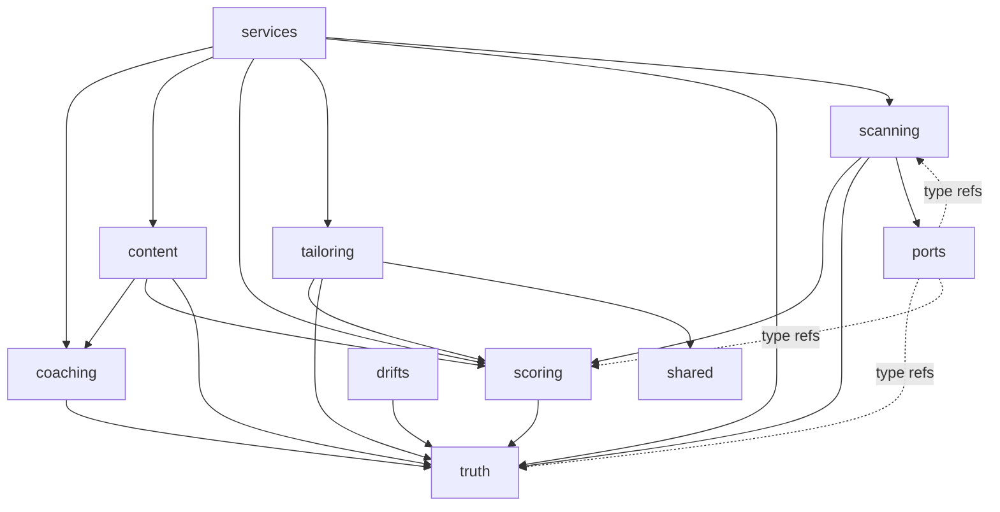

# Selfwright — Bounded-Context Map

Each directory under `packages/core/src/` is a bounded context. A context
may import a sibling context **only through that sibling's `index.ts`**.
This rule is enforced by `FF-CONTEXT-1` (see `docs/fitness-functions.md`).
Two built-in exceptions: `shared/` (shared kernel, freely importable) and
`ports/` (hexagonal contracts, directly importable by any context).

---

## Contexts

| Context | Directory | One-line purpose |
|---------|-----------|-----------------|
| `truth` | `packages/core/src/truth/` | Single source of authoritative facts: schemas, evidence tracing, honesty wall, R19 guard |
| `scoring` | `packages/core/src/scoring/` | Scan-time and JD-fit scoring, ATS pass A/B, priority ranking |
| `scanning` | `packages/core/src/scanning/` | Intake pipeline: fetch postings, liveness classification, dedup, queue management |
| `tailoring` | `packages/core/src/tailoring/` | Apply overlays and drift applications to a CV; produce TailoredCvContent |
| `coaching` | `packages/core/src/coaching/` | Gap coverage, evidence retrieval, drill selection, debrief analysis |
| `content` | `packages/core/src/content/` | Periodic and application-mode content topic selection |
| `drifts` | `packages/core/src/drifts/` | Drift scoring, validation, and filtering (pure functions over DriftEntry) |
| `services` | `packages/core/src/services/` | Application services: orchestrate contexts for CLI/MCP commands |
| `ports` | `packages/core/src/ports/` | Hexagonal contracts (LLM, storage, truth loader, scan provider, render, memory) |
| `shared` | `packages/core/src/shared/` | Shared kernel: `Result<T, E>` type only |

---

## Dependency map

The arrows show allowed (and actual) import directions between contexts.
Dashed arrows from `ports` indicate that port files reference domain types
directly (they define the contract, so they may import from the contexts
they abstract).

---

## Allowed-dependency rules

1. **Index-only cross-context imports** (`FF-CONTEXT-1`): every import of a
   symbol from context B inside context A must target `B/index.ts`, never a
   deep file inside `B/`.

2. **No upward imports from services**: `scoring`, `coaching`, `tailoring`,
   `content`, `drifts`, and `scanning` must not import from `services/`.

3. **No adapter imports from core** (`FF-PORT-1`): no context may import from
   `packages/adapters/` or any framework npm package.

4. **No circular dependencies** (`FF-PORT-1`): checked by dependency-cruiser.

5. **`ports/` is a trust boundary**: port files declare contracts using domain
   types but must never re-export context internals (e.g. `export { Foo } from
   "../coaching/types.js"` inside a port file launders a deep internal past the
   boundary check). Direct `import` of domain types for the port's own type
   declaration stays legal. `FF-CONTEXT-1` enforces this mechanically by
   scanning `ports/*.ts` for re-export-from-context statements.

---

## Adding a new context

1. Create `packages/core/src/<name>/` with at least one source file and an
   `index.ts` that re-exports the public API.
2. Ensure the new context only imports sibling contexts through their
   `index.ts` files.
3. Verify with `pnpm fitness` (FF-CONTEXT-1 must still pass, 0 violations).
4. If the new context introduces a dependency not shown in the map above,
   update this file.
5. Add the context to the context table and mermaid diagram.
6. Record the architectural decision in `docs/adr/`.
